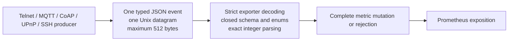

# Metrics and Measurement Contract

This document describes the supported EventHorizon Prometheus surface: metric families, types, labels, histogram buckets, producer events, and observation boundaries.

Producers emit bounded JSON events through the shared Unix datagram socket. Each event is one UTF-8 JSON object, at most 512 bytes, with fixed fields and fixed label values. Attacker-controlled values never become metric labels.

## Observation units and interpretation

EventHorizon defines observation units specific to each protocol instead of treating every interaction as a generic session:

| Protocol | Observation unit | Important limitation |
| --- | --- | --- |
| Telnet | One tracked session per accepted TCP connection | Not a login, command, or negotiation session |
| MQTT | One Network Connection per accepted TCP connection | Not a persistent MQTT Session or unique client |
| CoAP | A request exchange and, separately, a Confirmable response reliability exchange | Not a session or connected client |
| UPnP | An SSDP discovery exchange and, separately, an HTTP device-description response | Discovery is not correlated with a later description request |
| SSH | One Endlessh tracked-client observation | Not peer-disconnect time because Endlessh does not read client sockets |


<!-- Shared interpretation rules:

- Server-side send boundaries prove only that EventHorizon handed bytes to the local transport. They do not prove client receipt, parsing, or application delivery.
- Duration histograms contain finalized observations only. Open work has no duration observation until it reaches a terminal boundary.
- These metrics do not independently prove attacker intent, counter-fingerprinting success, or deception effectiveness. -->

## Measurement path



- Five producers use the 24 typed event wrappers in `shared/metric_events.c`.
- Producer and exporter both enforce the 512-byte limit.
- Duplicate keys, unknown fields, invalid enums, invalid numeric forms, and incompatible protocol/event pairs are rejected before metric mutation.
- Each accepted event applies as one aggregate mutation under the exporter mutex.
- Active gauges are producer-owned absolute observations. A Prometheus scrape is not a transaction across different collectors, so reconciliation requires settled boundary scrapes.

## Metric families

| Family | Type | Explicit labels | Meaning |
| --- | --- | --- | --- |
| `total_connects` | counter | `server` | Accepted Telnet, MQTT, and SSH TCP connections |
| `current_connected_clients` | gauge | `server` | Current accepted Telnet and MQTT connections |
| `eventhorizon_protocol_actions_total` | counter | `protocol`, `action` | Protocol actions crossing defined server-side boundaries |
| `eventhorizon_read_errors_total` | counter | `protocol`, `reason` | Primary unrecoverable Telnet and MQTT read failures |
| `eventhorizon_write_errors_total` | counter | `protocol`, `reason` | Write failures crossing defined reliability boundaries |
| `eventhorizon_exporter_malformed_messages_total` | counter | `reason` | Metric datagrams rejected before business mutation |
| `eventhorizon_bytes_received_total` | counter | `protocol` | Positive Telnet and MQTT client-facing read bytes |
| `eventhorizon_bytes_sent_total` | counter | `protocol` | Positive Telnet and MQTT client-facing write bytes |
| `eventhorizon_completed_sessions_total` | counter | `protocol`, `disconnect_reason` | Finalized tracked Telnet sessions |
| `eventhorizon_session_duration_ms` | histogram | `protocol` | Accepted-to-finalized Telnet session duration |
| `eventhorizon_session_interaction_depth_total` | counter | `protocol`, `depth_level` | Final Telnet interaction-depth classification |
| `eventhorizon_telnet_first_write_delay_ms` | histogram | none | Accepted connection to first positive Telnet server write |
| `eventhorizon_telnet_inter_write_interval_ms` | histogram | none | Time between consecutive positive Telnet server writes |
| `eventhorizon_mqtt_network_connection_finalizations_total` | counter | `finalization_reason` | Finalized MQTT Network Connections |
| `eventhorizon_mqtt_network_connection_duration_ms` | histogram | none | Accepted-to-finalized MQTT Network Connection duration |
| `eventhorizon_mqtt_network_connection_interaction_depth_total` | counter | `depth_level` | Final MQTT interaction-depth classification |
| `eventhorizon_mqtt_connect_to_connack_duration_ms` | histogram | none | Accepted supported CONNECT to complete CONNACK transmission |
| `eventhorizon_coap_active_request_exchanges` | gauge | none | CoAP GET requests awaiting response or termination |
| `eventhorizon_coap_request_exchange_duration_ms` | histogram | `outcome` | Accepted CoAP GET to response or termination |
| `eventhorizon_coap_active_con_response_exchanges` | gauge | none | Confirmable responses awaiting ACK, RST, or retry exhaustion |
| `eventhorizon_coap_con_response_exchange_duration_ms` | histogram | `outcome` | First Confirmable response send to its reliability outcome |
| `eventhorizon_upnp_active_description_responses` | gauge | none | Started UPnP descriptions not yet completed or terminated |
| `eventhorizon_upnp_description_stream_duration_ms` | histogram | `outcome` | First positive description write to completion or termination |
| `eventhorizon_ssh_tracked_client_lifetime_ms` | histogram | `observation_end_reason` | Accepted SSH connection to removal from Endlessh tracking |

No family uses an identity, address, endpoint, Client Identifier, URI, path, LOCATION, topic, Topic Filter, Token, Message ID, Packet Identifier, credential, payload, content, errno, error text, retry count, QoS, phase, configuration, experiment, commit, or fingerprint label.

<details>
<summary>Exact Prometheus HELP and TYPE exposition</summary>

```text
# HELP total_connects Total accepted TCP connections tracked by the EventHorizon Telnet and MQTT tarpits and by the integrated Endlessh SSH tarpit.
# TYPE total_connects counter
# HELP current_connected_clients Current accepted TCP connections tracked by the EventHorizon Telnet and MQTT servers.
# TYPE current_connected_clients gauge

# HELP eventhorizon_protocol_actions_total Total protocol actions crossing their frozen EventHorizon server-side observation boundaries.
# TYPE eventhorizon_protocol_actions_total counter
# HELP eventhorizon_read_errors_total Total primary unrecoverable read-side I/O failures that finalize tracked Telnet or MQTT TCP connections.
# TYPE eventhorizon_read_errors_total counter
# HELP eventhorizon_write_errors_total Total write-side I/O failures crossing frozen EventHorizon reliability boundaries.
# TYPE eventhorizon_write_errors_total counter
# HELP eventhorizon_exporter_malformed_messages_total Total malformed or unsupported metric datagrams observed and rejected by the EventHorizon exporter.
# TYPE eventhorizon_exporter_malformed_messages_total counter
# HELP eventhorizon_bytes_received_total Positive bytes returned by Telnet and MQTT client-facing reads; includes protocol framing and incomplete input, and excludes EOF, failed, retryable, or zero-byte I/O and internal telemetry.
# TYPE eventhorizon_bytes_received_total counter
# HELP eventhorizon_bytes_sent_total Positive bytes returned by Telnet and MQTT client-facing writes; includes partial writes and protocol framing, and excludes failed, retryable, or zero-byte I/O and internal telemetry.
# TYPE eventhorizon_bytes_sent_total counter

# HELP eventhorizon_completed_sessions_total Total finalized tracked Telnet TCP sessions by finalization reason.
# TYPE eventhorizon_completed_sessions_total counter
# HELP eventhorizon_session_duration_ms Duration in milliseconds from accepted Telnet TCP connection to exactly-once session finalization.
# TYPE eventhorizon_session_duration_ms histogram
# HELP eventhorizon_session_interaction_depth_total Total finalized tracked Telnet sessions by bounded meaningful application-interaction depth.
# TYPE eventhorizon_session_interaction_depth_total counter
# HELP eventhorizon_telnet_first_write_delay_ms Duration in milliseconds from accepted Telnet TCP connection to its first positive server write.
# TYPE eventhorizon_telnet_first_write_delay_ms histogram
# HELP eventhorizon_telnet_inter_write_interval_ms Duration in milliseconds between consecutive positive server writes on a tracked Telnet session.
# TYPE eventhorizon_telnet_inter_write_interval_ms histogram

# HELP eventhorizon_mqtt_network_connection_finalizations_total Total finalized tracked MQTT Network Connections by finalization reason.
# TYPE eventhorizon_mqtt_network_connection_finalizations_total counter
# HELP eventhorizon_mqtt_network_connection_duration_ms Duration in milliseconds from accepted MQTT TCP connection to exactly-once Network Connection finalization.
# TYPE eventhorizon_mqtt_network_connection_duration_ms histogram
# HELP eventhorizon_mqtt_network_connection_interaction_depth_total Total finalized MQTT Network Connections by bounded meaningful application-interaction depth.
# TYPE eventhorizon_mqtt_network_connection_interaction_depth_total counter
# HELP eventhorizon_mqtt_connect_to_connack_duration_ms Duration in milliseconds from accepted supported MQTT CONNECT to complete successful CONNACK transmission.
# TYPE eventhorizon_mqtt_connect_to_connack_duration_ms histogram

# HELP eventhorizon_coap_active_request_exchanges Current accepted CoAP GET request exchanges awaiting response transmission or termination.
# TYPE eventhorizon_coap_active_request_exchanges gauge
# HELP eventhorizon_coap_request_exchange_duration_ms Duration in milliseconds from accepted CoAP GET request to response transmission or termination.
# TYPE eventhorizon_coap_request_exchange_duration_ms histogram
# HELP eventhorizon_coap_active_con_response_exchanges Current transmitted CoAP Confirmable response exchanges awaiting ACK, RST, or retry exhaustion.
# TYPE eventhorizon_coap_active_con_response_exchanges gauge
# HELP eventhorizon_coap_con_response_exchange_duration_ms Duration in milliseconds from first CoAP Confirmable response transmission to ACK, RST, or retry exhaustion.
# TYPE eventhorizon_coap_con_response_exchange_duration_ms histogram

# HELP eventhorizon_upnp_active_description_responses Current UPnP device-description responses that have started but not completed or terminated.
# TYPE eventhorizon_upnp_active_description_responses gauge
# HELP eventhorizon_upnp_description_stream_duration_ms Duration in milliseconds from the first positive device-description response write to completion or termination.
# TYPE eventhorizon_upnp_description_stream_duration_ms histogram

# HELP eventhorizon_ssh_tracked_client_lifetime_ms Observed lifetime in milliseconds of an Endlessh-tracked SSH client, from accepted TCP connection until removal from the tracked-client set.
# TYPE eventhorizon_ssh_tracked_client_lifetime_ms histogram
```

</details>

## Labels and histogram buckets

### Closed label schemas

`eventhorizon_protocol_actions_total{protocol,action}` initializes only these compatible pairs:

| `protocol` | Allowed `action` values |
| --- | --- |
| `upnp` | `ssdp_msearch_received`, `ssdp_discovery_response_sent`, `description_get_received`, `description_response_started`, `description_response_completed`, `description_response_terminated` |
| `coap` | `get_request_received`, `get_response_sent`, `get_request_terminated`, `con_response_sent`, `con_response_retransmitted`, `con_response_ack_received`, `con_response_rst_received`, `con_response_retry_exhausted` |
| `mqtt` | `connect_accepted`, `connack_sent`, `publish_received`, `subscribe_received`, `unsubscribe_received`, `suback_sent`, `unsuback_sent`, `puback_sent`, `pubrec_sent`, `pubrel_received`, `pubcomp_sent`, `subscription_publish_sent` |

Telnet has no action series. Summing this family across protocols combines unrelated boundaries and has no useful interpretation.

| Family | Exact label values |
| --- | --- |
| `eventhorizon_read_errors_total` | `protocol="telnet"`/`"mqtt"`; `reason="timeout"`/`"reset"`/`"closed"`/`"other"` |
| `eventhorizon_write_errors_total` | `protocol="upnp"`/`"coap"`/`"telnet"`/`"mqtt"`; the same four reasons |
| `eventhorizon_exporter_malformed_messages_total` | `reason="empty_message"`/`"missing_fields"`/`"unknown_format"`/`"unknown_server"`/`"invalid_number"`/`"unsupported_event"` |
| `eventhorizon_bytes_received_total`, `eventhorizon_bytes_sent_total` | `protocol="telnet"`/`"mqtt"` |
| `total_connects` | `server="Telnet"`/`"MQTT"`/`"SSH"` |
| `current_connected_clients` | `server="Telnet"`/`"MQTT"` |
| `eventhorizon_completed_sessions_total` | `protocol="telnet"`; `disconnect_reason="peer_closed"`/`"read_error"`/`"write_error"`/`"server_shutdown"`/`"bounded_policy"` |
| `eventhorizon_session_interaction_depth_total` | `protocol="telnet"`; `depth_level="0"`/`"1"`/`"2"`/`"3"` |
| `eventhorizon_mqtt_network_connection_finalizations_total` | `finalization_reason="peer_closed"`/`"disconnect_received"`/`"connect_refused"`/`"operation_refused"`/`"protocol_error"`/`"keep_alive_timeout"`/`"read_error"`/`"write_error"`/`"server_shutdown"`/`"bounded_policy"` |
| `eventhorizon_mqtt_network_connection_interaction_depth_total` | `depth_level="0"`/`"1"`/`"2"`/`"3"` |
| `eventhorizon_coap_request_exchange_duration_ms` | `outcome="response_sent"`/`"terminated"` |
| `eventhorizon_coap_con_response_exchange_duration_ms` | `outcome="ack_received"`/`"rst_received"`/`"retry_exhausted"` |
| `eventhorizon_upnp_description_stream_duration_ms` | `outcome="completed"`/`"terminated"` |
| `eventhorizon_ssh_tracked_client_lifetime_ms` | `observation_end_reason="write_failed"`/`"server_shutdown"` |

The producer maps socket failures to four bounded reasons:
- `closed` covers conditions such as broken pipe, not connected, or shutdown
- TCP EOF is a clean peer finalization, not an I/O error
- A short positive UDP send is `other`
- The exporter validates the enum and never exposes errno

### Histogram buckets

All boundaries are milliseconds. Prometheus adds `+Inf`, `_sum`, and `_count` to the finite buckets below.

| Histogram | Exact finite buckets |
| --- | --- |
| `eventhorizon_session_duration_ms` | `10 50 100 250 500 1000 2500 5000 10000 30000 60000` |
| `eventhorizon_telnet_first_write_delay_ms` | `10 25 50 75 100 125 150 200 250 500 1000 2500 5000 10000` |
| `eventhorizon_telnet_inter_write_interval_ms` | `10 25 50 75 100 125 150 200 250 500 1000 2500 5000 10000` |
| `eventhorizon_mqtt_connect_to_connack_duration_ms` | `1 2 5 10 25 50 75 100 125 150 200 250 500 1000 2500 5000 10000 30000 60000` |
| `eventhorizon_mqtt_network_connection_duration_ms` | `10 50 100 250 500 1000 2500 5000 10000 30000 60000 120000 300000 600000 1800000 3600000 21600000 86400000 604800000` |
| `eventhorizon_coap_request_exchange_duration_ms` | `1 2 5 10 25 50 100 250 500 1000 2500 5000 10000 30000 60000 120000 300000 600000` |
| `eventhorizon_coap_con_response_exchange_duration_ms` | `1 2 5 10 25 50 100 250 500 1000 2000 3000 6000 12000 24000 45000 60000` |
| `eventhorizon_upnp_description_stream_duration_ms` | `1 2 5 10 25 50 100 250 500 1000 2500 5000 10000 15000 20000 25000 30000 60000` |
| `eventhorizon_ssh_tracked_client_lifetime_ms` | `1000 5000 10000 20000 30000 60000 120000 300000 600000 1800000 3600000 21600000 86400000 604800000` |

<!-- Histogram sums are observed durations, not configured delays. -->

## Producer event contract

Every event requires exactly `v=1`, `protocol`, `event`, and the fields listed for its event type. Unlisted fields are rejected, and integer fields are decoded as integers, not `float64`.

<details>
<summary>24 typed producer events</summary>

### Telnet: 5 events

| Event | Required event fields | Metric effect |
| --- | --- | --- |
| `connection_accepted` | `active_count_after` | Increment connects and set the absolute active gauge |
| `connection_finalized` | `finalization_reason`, `duration_ms`, `depth_level`, `active_count_after`, `io_reason` | Update finalization, duration, depth, active gauge, and applicable primary I/O error |
| `positive_read` | `bytes` | Add positive received bytes |
| `first_positive_write` | `duration_ms`, `bytes` | Add sent bytes and observe first-write delay |
| `subsequent_positive_write` | `duration_ms`, `bytes` | Add sent bytes and observe one inter-write interval |

### MQTT: 7 events

| Event | Required event fields | Metric effect |
| --- | --- | --- |
| `connection_accepted` | `active_count_after` | Increment connects and set the absolute active gauge |
| `connection_finalized` | `finalization_reason`, `duration_ms`, `depth_level`, `active_count_after`, `io_reason` | Update finalization, duration, depth, gauge, and applicable primary I/O error |
| `positive_read` | `bytes` | Add positive received bytes |
| `positive_write` | `bytes` | Add positive sent bytes, including partial writes |
| `protocol_action` | `action` | Increment one compatible non-CONNACK action |
| `connack_sent` | `duration_ms` | Increment `connack_sent` and observe CONNECT-to-CONNACK duration |
| `secondary_write_error` | `io_reason` | Increment only the MQTT write-error counter |

### CoAP: 6 events

| Event | Required event fields | Metric effect |
| --- | --- | --- |
| `request_received` | `request_active_count_after` | Increment request received and set the request gauge |
| `request_finalized` | `outcome`, `duration_ms`, `request_active_count_after` | Increment the terminal action, observe duration, and set the gauge |
| `con_response_sent` | `request_duration_ms`, `request_active_count_after`, `con_active_count_after` | Finalize the request exchange, start CON reliability, and set both gauges |
| `con_response_retransmitted` | none | Increment only the retransmission action |
| `con_response_finalized` | `outcome`, `duration_ms`, `con_active_count_after` | Increment the CON terminal action, observe duration, and set the gauge |
| `write_error` | `io_reason` | Increment only the CoAP write-error counter |

### UPnP: 4 events

| Event | Required event fields | Metric effect |
| --- | --- | --- |
| `protocol_action` | `action` | Increment one compatible discovery or description action |
| `description_response_started` | `active_count_after` | Increment response started and set the absolute active gauge |
| `description_response_finalized` | `outcome`, `duration_ms`, `active_count_after` | Increment the terminal action, observe duration, and set the gauge |
| `write_error` | `io_reason` | Increment only the UPnP write-error counter |

### SSH (Endlessh): 2 events

| Event | Required event fields | Metric effect |
| --- | --- | --- |
| `connection_accepted` | none | Increment SSH connects; no active gauge |
| `tracked_client_finalized` | `observation_end_reason`, `lifetime_ms` | Observe tracked-client lifetime under the end reason |

<!-- Active-count fields are bounded `uint32` absolute producer state. Positive bytes are `1..9007199254740991`. General durations are `0..9007199254740991`; completed UPnP duration is bounded to `0..30000`. Depth is `0..3`. -->

</details>

<!-- The exporter validates event schema and aggregate mutation. Connection-local MQTT sequencing and request-local CoAP correlation remain producer invariants because identifiers are intentionally absent from telemetry. -->

## Protocol boundaries

| Protocol | Start or success boundary | Finalization or interpretation boundary |
| --- | --- | --- |
| Telnet | A successful `accept()` starts a tracked session. Positive read and write return values add byte evidence. | One terminal reason finalizes duration and depth. The first positive write records first-write timing; later positive writes record inter-write timing. |
| MQTT | A successful `accept()` starts one Network Connection. A CONNACK action requires complete transmission. | One bounded reason finalizes Network Connection duration and depth. A partial Control Packet write emits no completed-packet action. |
| CoAP | An accepted GET starts a request exchange. A sent or retransmitted action requires `sendto()` to return the exact datagram length. | Sending the first CON response finalizes the request exchange and starts an independent reliability exchange ending in ACK, RST, or retry exhaustion. |
| UPnP | SSDP discovery actions are independent. The first positive description write starts a description response. | Completion requires full HTTP headers and exactly the declared XML body within 30 seconds; otherwise the started response terminates. |
| SSH | A successful `accept()` starts an Endlessh tracked-client observation. | A non-retryable scheduled write failure removes the client, or server shutdown right-censors the observation. |

Shared I/O rules:

- Positive partial TCP writes count actual bytes, but do not automatically count a completed protocol action.
- A short positive UDP send counts as write error `other` and no sent action.
- Zero, interrupted, retryable, would-block, pending, and failed operations do not cross a success boundary.
- A successful server write does not prove client receipt.

### SSH interpretation

- `observation_end_reason="write_failed"` means a scheduled write failed and Endlessh removed the tracked client. It does not identify the exact peer-disconnect time or necessarily its cause.
- `observation_end_reason="server_shutdown"` is right-censored. The true tracked-client lifetime is at least the recorded value and remains unknown.
- Endlessh does not read client sockets, so no SSH active gauge is exposed. SSH also has no interaction depth, protocol action, response timing, or byte family.
- SSH tracked-client lifetime must not be compared directly with Telnet session duration, which finalizes on an observed read-side terminal boundary.

## Reconciliation

Reconciliation requires a complete, uninterrupted process epoch and settled baseline and final scrapes. Restart, reset, missing telemetry, missing scrapes, possible duplicate delivery, inconsistent absolute gauges, or a concurrent torn scrape makes the affected result `INCONCLUSIVE`.

<details>
<summary>Reconciliation equations</summary>

```text
delta(total_connects{server="Telnet"})
- sum(delta(eventhorizon_completed_sessions_total{protocol="telnet"}))
= active_end_telnet - active_start_telnet

delta(total_connects{server="MQTT"})
- sum(delta(eventhorizon_mqtt_network_connection_finalizations_total))
= active_end_mqtt - active_start_mqtt

sum(delta(eventhorizon_completed_sessions_total{protocol="telnet"}))
= delta(eventhorizon_session_duration_ms_count{protocol="telnet"})
= sum(delta(eventhorizon_session_interaction_depth_total{protocol="telnet"}))

sum(delta(eventhorizon_mqtt_network_connection_finalizations_total))
= delta(eventhorizon_mqtt_network_connection_duration_ms_count)
= sum(delta(eventhorizon_mqtt_network_connection_interaction_depth_total))

delta(eventhorizon_mqtt_connect_to_connack_duration_ms_count)
= delta(eventhorizon_protocol_actions_total{protocol="mqtt",action="connack_sent"})

delta(eventhorizon_coap_request_exchange_duration_ms_count{outcome="response_sent"})
= delta(eventhorizon_protocol_actions_total{protocol="coap",action="get_response_sent"})

delta(eventhorizon_coap_request_exchange_duration_ms_count{outcome="terminated"})
= delta(eventhorizon_protocol_actions_total{protocol="coap",action="get_request_terminated"})

sum(delta(eventhorizon_coap_con_response_exchange_duration_ms_count))
= sum(delta(eventhorizon_protocol_actions_total{protocol="coap",action=~"con_response_ack_received|con_response_rst_received|con_response_retry_exhausted"}))

delta(eventhorizon_upnp_description_stream_duration_ms_count{outcome="completed"})
= delta(eventhorizon_protocol_actions_total{protocol="upnp",action="description_response_completed"})

delta(eventhorizon_upnp_description_stream_duration_ms_count{outcome="terminated"})
= delta(eventhorizon_protocol_actions_total{protocol="upnp",action="description_response_terminated"})
```

</details>

SSH has no independent active-state reconciliation because it has no producer-owned active gauge. For each histogram population, the `+Inf` bucket equals `_count`. Byte-counter deltas equal positive TCP read or write return values. The malformed-family delta sum equals metric datagrams observed and rejected by the exporter.

## Interpretation limits

| Evidence | What it establishes | What it does not establish |
| --- | --- | --- |
| TCP lifecycle | Accepted and finalized Telnet sessions and MQTT Network Connections | Unique clients, people, devices, logins, MQTT Sessions, or accepted CONNECT |
| Protocol actions | Defined server-side action boundaries | Client receipt, parsing, engagement, or counter-fingerprinting success |
| Active gauges | Latest producer-observed active work | Complete history or recovery after exporter restart |
| Histograms | Finalized server-side duration distributions | Configured delay, round-trip time, active age, or client-perceived latency |
| Application bytes | Positive Telnet and MQTT socket-return bytes | Complete messages, meaningful content, wire volume, or client receipt |
| I/O errors | Bounded qualifying server-side socket outcomes | Client fault, packet loss, protocol failure rate, or telemetry completeness |
| Malformed events | Invalid datagrams observed and rejected by the exporter | Valid-datagram delivery, duplicate detection, or valid producer behavior |
| SSH tracked-client lifetime | Time retained in Endlessh tracking and the observed end reason | Peer-disconnect time, clean disconnect, cause, or values independent of write cadence |

Container runtime metrics remain separate optional defender-cost evidence. Session JSONL remains separate research evidence. Neither is reconstructed from this Prometheus contract.

## Validation

| Layer | Coverage |
| --- | --- |
| Unit validation | Bounded C event helpers, strict Go decoding, rejection paths, metric metadata, labels, and buckets |
| Cross-language integration | Five real C producers send Unix datagrams through the actual Go ingestion path into a Prometheus registry |
| Runtime validation | Real protocol traffic crosses the expected boundary and changes the expected metric |
| Dashboard and Compose | The dashboard checker covers all 24 families; the focused smoke test verifies exporter, Prometheus, Grafana, and one Telnet connection |

<!-- The Compose smoke test is deliberately not an all-protocol runtime test. The real-producer integration suites provide deterministic coverage for all five producer paths. -->
